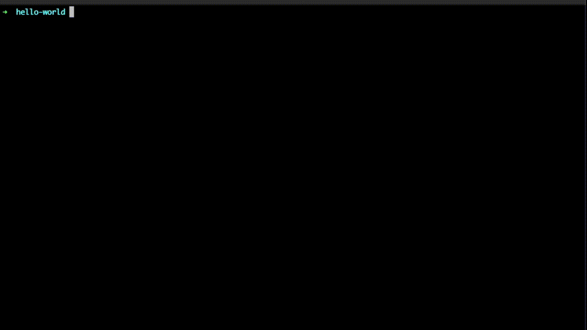

# Golem JavaScript API


 


[](https://github.com/golemfactory/yajsapi/issues)


## What's Golem and yajsapi?

**[The Golem Network](https://golem.network)** fosters a global group of creators building ambitious software solutions that will shape the technological landscape of future generations by accessing computing resources across the platform. Golem Network is an accessible, reliable, open access and censorship-resistant protocol, democratizing access to digital resources and connecting users through a flexible, open-source platform.

**Yajsapi** is the JavaScript API that allows developers to connect to their Golem nodes and manage their distributed, computational loads through Golem Network.

## Golem application development

For a detailed introduction to using Golem and yajsapi to run your tasks on Golem and a guide to Golem Network application development in general, [please consult our handbook](https://handbook.golem.network/requestor-tutorials/flash-tutorial-of-requestor-development).

### Installation

`yajsapi` is available as a [NPM package](https://www.npmjs.com/package/yajsapi/).

You can install it through `npm`:

```bash
npm install yajsapi
```
or by `yarn`:

```bash
yarn add yajsapi
```

### Building

To build a library available to the nodejs environment:

```bash
npm run build
```

or

```bash
yarn build
```

This will generate production code in the `dist/` directory ready to be used in your nodejs applications.

To build a browser runnable library:

```bash
npm run build:browser
```

or 

```bash
yarn build:browser
```

Then include `dist/yajsapi.min.js` in your html file.

### API Reference

For a comprehensive API reference, please refer to [our official API reference page](https://handbook.golem.network/yajsapi/).

### Usage




Tutorial (link)

### Testing

### Running unit tests

```bash
npm run test:unit
```

or

```bash
yarn test:unit
```

### Running integration tests

#### Nodejs

#### Cypress

### Contributing
  - todo
